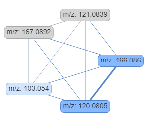

# MS1FA 

[](https://shields.io/)


`MS1FA` is a R Shiny APP designed to facilitate annotation of untargeted metabolomics data. It simplifies the process of analyzing mass spectrometry data by providing interactive tools for data visualization and annotation. It requires users upload the feature table (pre-processed LC-MS data by widely used `XCMS` or `MZmine` ), a pooled MS2 file (.mzXL) or a a MS/MS spectral summary file from `MZmine`(.mgf) and a targeted list of metabolites (.csv or .library). The output is an interactive feature table with metabolite annotation, neutral loss annotation, adducts annotation, ISF annotation, group and correlation group.

`MS1FA` is written in R and Rcpp, and its source code is publicly available at [GitHub](https://github.com/RuibingS/MS1FA_RShiny_dashboard).

## Table of Contents
- [Installation Instructions](#installation-instructions)
  - [ Use `renv` to create reproducible environments](#Use_`renv`_to_create_reproducible_environments)
  - [Manually install required packages](#Manually_install_required_packages)
  - [Run MS1FA](#run-ms1fa)
- [Files Upload](#files-upload)
  - [Required Files](#required-files)
- [Setting Parameters](#setting-parameters)
- [Output](#output)
  - [Feature Table](#feature-table)
  - [Interactive Network Plot](#interactive-network-plot)
  - [Box Plot](#box-plot)


## Installation Instructions
R version 4.2.0 or above is required. To install MS1FA R Shiny APP successfully, please install the following packages.
### Use `renv` to  create reproducible environments
Clone MS1FA repository
```sh
git clone https://github.com/RuibingS/MS1FA_RShiny_dashboard.git
```
Navigate to the loacl directory
```sh
cd path/to/cloned/MS1FA_RShiny_dashboard
```
Install `renv`
```r
install.packages("renv")
```
open R or RStudio

```r
setwd("path/to/cloned/MS1FA_RShiny_dashboard")
```
Use renv to restore the package environment
```r
renv::restore()
```
### Manually install required packages
Installing and loading the CRAN Packages
```
cran_packages <- c(
  "shiny", "DT", "shinyWidgets", "dplyr", "igraph", "stringr",
  "readxl", "purrr", "readr", "plyr", "data.table",
  "tidyverse", "hrbrthemes", "viridis", "viridisLite", "ggplot2", "roxygen2",
  "rlang", "RcppArmadillo", "webshot", "htmlwidgets", "profvis", "shinythemes",
  "shinyjs", "visNetwork", "bs4Dash","magick","chromote"
)

install_cran_packages <- function(packages) {
  for (pkg in packages) {
    if (!require(pkg, character.only = TRUE, quietly = TRUE)) {
      install.packages(pkg)
      print(paste0("Please install the required package: ", pkg))
      # After installation, load the package
      library(pkg, character.only = TRUE)
    } else {
      # If already installed, just make sure it's loaded
      library(pkg, character.only = TRUE)
    
    }
  }
}
# load all libraries
install_cran_packages(packages=cran_packages)
```
Installing and loading the Bioconductor Packages
```
if (!requireNamespace("BiocManager", quietly = TRUE)) {
  install.packages("BiocManager")
}
# Function to install Bioconductor packages
bioconductor_packages <- c(
  "MetaboCoreUtils", "enviPat","MSnbase"
)
install_bioconductor_packages <- function(packages) {
  for (pkg in packages) {
    if (!require(pkg, character.only = TRUE, quietly = TRUE)) {
      print(paste0("Please install the required package: ", pkg)) 
      BiocManager::install(pkg)
      library(pkg, character.only = TRUE)
      
    }
    else {
      # If already installed, just make sure it's loaded
      library(pkg, character.only = TRUE)
     
    }
  }
}
install_bioconductor_packages(packages=bioconductor_packages)
```
### Run MS1FA
Users should set their working directory to the cloned repository and use shiny::runApp() to run the app:
```r
setwd("path/to/cloned/MS1FA_RShiny_dashboard")
shiny::runApp()
```
or users can install MS1FA from GitHub. First, you need to install the devtools package and load it.
```r
install.packages("devtools")
library(devtools)
```
Then you can install MS1FA from GitHub then run it:
```r
install_github("RuibingS/MS1FA_RShiny_dashboard")
setwd("path/to/cloned/MS1FA_RShiny_dashboard")
shiny::runApp()
```


## Files Upload

### Required Files
- **Feature table file**: The app accepts the feature table export from XCMS and MZmine in comma-separated values format(.csv).
  - *Expected Columns*:
    - feature_name: the ID of the features in the format FT with four digits (e.g."FT0001") if missing, the app generates the "feature_name" column.
    - mz: Mass-to-charge ratio of the features.
    - rt: Retention time of the features in seconds.
    - samples: Intensity values in each sample.
- **MS2 file**: A pool sample MS2 file (.mzXML) or a MS/MS spectral summary file from `MZmine` (.mgf).
- **Library file**: A in-house library (.library) or a targeted metabolites list (.csv).
   - *Expected Columns*:
     - Name: The metabolite name.
     - Formula: The chemical formula of the metabolite.
     - RetTime: The retention time in seconds if avaliave, else the app creates NA.
- **Neutral loss file**: The app uses the Neutral loss file from Fiehn's lab as the default file.
- **ESI MS adducts file**: The app uses the ESI MS adducts file from Fiehn's lab as the default file plus the addut table from `MetaboCoreUtils`.


## Setting Parameters
**1. Filter the feature table by retention time**: A slider input to filter the feature table by retention time (in seconds).Default 70 seconds to 1500 seconds. User can modify it according to their own setup.

**2. Check isotopes and multiple charge states**: A check box to run the function of annotating the C13 isotopes and multiple charge states. The default value is TRUE. Import `data(isotopes)` is from `enviPat` R package.

**3. Correlation method**: A select input for the correlation methods, "pearson", "kendall" and "spearman". The default selection is "pearson".

**4. Correlation threshold**: A numeric input range from 0 to 1. The default value is 0.8.

**5. Retention time threshold (in second)**:
  - **RT threshold for correlation**: The RT threshold to group the corelated features with default value is 2 seconds.
  - **RT threshold for metabolites identification**: The RT threshold to identify the metabolites from the library if the retention time is available with default value is 30 seconds.
  - **RT threshold for precursor feature matching**: The RT threshold to match the precursor ions in the MS2 file to the feature table. The default value is 30.
  - **RT threshold for MS2 feature matching**: The RT threshold to match the MS2 ions of the precursor ions in the MS2 file to the feature table. The default value is 20.
  - **RT threshold for neutral loss feature matching**: The RT threshold to filter each pair of neutral loss features. The default value is 2.
  - **RT threshold for adducts feature matching**: The RT threshold to filter each pair of adducts features. The default value is 2.

**6. Primary ions**:
  - **Ion polarity**: A select input of positive ("pos") or negative ("neg")ion polarity. The dafault is "pos".
  - **Primary ion:**: A select input of primary ion "[M+H]+" and "[M+Na]+" for positive mode and "[M-H]-" for negative mode. The dafault selections are "[M+H]+" and "[M+Na]+".

**7. ppm**:
  - **ppm for exact m/z matching**: The ppm to identify the metabolites. The default value is 5.
  - **ppm for precursor m/z matching**: The ppm to identify the precursor m/z. The default value is 5.
  - **ppm for MS2 m/z matching**: The ppm to identify the MS2 m/z. The default value is 10.
  - **ppm for neutral losses m/z matching**: The ppm to identify the neutral loss features m/z. The default value is 5.
  - **ppm for adducts m/z matching**: The ppm to identify the adducts features m/z. The default value is 5.

**8. m/z difference tolerance**:
  - **m/z difference for exact m/z matching**: The m/z difference threshold to identify the metabolites. The default value is 0.002.
  - **m/z difference for precursor m/z matching**: The m/z difference threshold to identify the precursor m/z. The default value is 0.002.
  - **m/z difference for MS2 m/z matching**: The m/z difference threshold to identify the MS2 m/z. The default value is 0.005.
  - **m/z difference for neutral losses m/z matching**: The m/z difference threshold to identify the neutral loss features m/z. The default value is 0.002.
  - **m/z difference for adducts m/z matching**: The m/z difference threshold to identify the adducts features m/z. The default value is 0.002.

## Output

### Feature Table
The feature table with colunms: "feature_name", "mz", "rt","metabolite_annotation","neutral_loss_annotation", "adducts_anno", "ISF_anno", "Iso_anno",
"group" and "cor_group". Users can download the feature table as a CSV file, which includes comprehensive details of the annotated metabolites.

- feature_name: the ID of the features.
- mz: Mass-to-charge ratio of the features.
- rt: Retention time of the features in seconds.
- metabolite_annotation: the identified metabolite name and the matched primary ions (e.g.L-Phenylalanine [M+H]+ )
- neutral_loss_annotation: the neutral loss features and the neutral loss names (e.g.FT0252<-FT0256 COOH)
- adducts_anno: the adducts annotation (e.g.[M+NH4]+ 149.051)
- ISF_anno: the precursor feature and their MS2 feature annotation (e.g. PI_match, FT0161_MS2match)
- group: the group index of all structure related features
- cor_group: the group index of Correlation related features

| feature_name| mz | rt |   metabolite_annotation  | neutral_loss_annotation | adducts_anno  | ISF_anno |Iso_anno| group|cor_group|
|------------|-------|----------------|--------------|----------|------|----|--------------------------|---------------------|-----|
| FT0252 |166.086 |210.1 | L-Phenylalanine [M+H]+; D-Phenylalanine [M+H]+| | [M+H]+ 165.079  |   | [3][M]+|group41 | corgroup110|
| FT0253 | 120.0805  |210.3  |  |  FT0252-HCOOH(H2+CO2 or H2O+CO) | [M+H-CH2O2]+ 165.079 |   |  [1][M]+ | group41 | corgroup110|
| FT0254 |167.0892  |210.6  | | | [M+NH4]+ 149.051 |   | [3][M+1]+ | group41 | corgroup110|
| FT0255 |103.054  |210.9  | | FT0255-NH3 |   | || group41 | corgroup110|
| FT0256 |121.0839 |211 | || [M+NH4]+ 149.051 |   | [1][M+1]+ | group41 | corgroup110|


### Interactive Network Plot

<p align="center">
  
</p>
<p align="center">
  <i>The network plot of L-Phenylalanine</i>
</p>
By selecting a row in the feature table, users can visualize an interactive network plot that illustrates the relationships between the groupped features. The node is comprised of m/z value of the feature. When users hover over the nodes,it shows the feature name, m/z, rt,the metabolie name. The color of node in gray means the feature is recognized as an isotope. The edges in the network plot show the correlation value, the m/z difference and the neutral loss annotation. The thicker edges indicates that the neutral loss is found.


### Box Plot

Similarly, selecting a row in the feature table allows users to generate a box plot, offering insights into the correlation related of features across different perturbation samples. The titles of each box plot is the name of feature. The classes are the samples and the values are the log10 transformed feature abundances.
<p align="center">
  
</p>
<p align="center">
  <i>The box plot of L-Phenylalanine</i>
</p>
---
