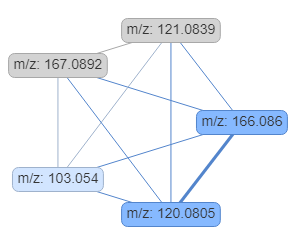

# MS1FA 

[](https://shields.io/)


`MS1FA` is a R Shiny APP designed to facilitate annotation of untargeted metabolomics data. It simplifies the process of analyzing mass spectrometry data by providing interactive tools for data visualization and annotation. It requires users upload the feature table (pre-processed LC-MS data by widely used `XCMS` or `MZmine` ), a pooled MS2 file (.mzXL) or a a MS/MS spectral summary file from `MZmine`(.mgf) and a targeted list of metabolites (.csv or .library). The output is an interactive feature table with metabolite annotation, neutral loss annotation, adducts annotation, ISF annotation, group and correlation group.

`MS1FA` is written in R and Rcpp, and its source code is publicly available at [GitHub](https://github.com/RuibingS/MS1FA_RShiny_dashboard).

## Table of Contents
- [Installation Instructions](#installation-instructions)
  - [Manually install required packages](#manually-install-required-packages)
  - [Run MS1FA on local PC](#run-ms1fa-on-local-pc)
  - [Run MS1FA on the server](#run-ms1fa-on-the-server)
- [Files Upload](#files-upload)
  - [Required Files](#required-files)
- [Setting Parameters](#setting-parameters)
- [Output](#output)
  - [Feature Table](#feature-table)
  - [Interactive Network Plot](#interactive-network-plot)
  - [Box Plot](#box-plot)
- [Case Study](#case-study)
- [Important Consideration](#important-consideration)
- [SessionInfo](#sessioninfo)

## Installation Instructions
R version 4.2.0 or above is required.To run the Shiny app on your local PC, please make sure that [Rtools](https://cran.r-project.org/bin/windows/Rtools/) is installed and refer `sessionInfo` for complete package information and consider to install the following packages.
### Manually install required packages
Installing and loading the CRAN Packages
```
cran_packages <- c(
  "shiny", "DT", "shinyWidgets", "dplyr", "igraph", "stringr",
  "readxl", "purrr", "readr", "plyr", "data.table",
  "tidyverse", "hrbrthemes", "viridis", "viridisLite", "ggplot2", "roxygen2",
  "rlang", "RcppArmadillo", "webshot", "htmlwidgets", "profvis", "shinythemes",
  "shinyjs", "visNetwork", "bs4Dash","magick","chromote","here","pryr","shinycssloaders"
)

install_cran_packages <- function(packages) {
  for (pkg in packages) {
    if (!require(pkg, character.only = TRUE, quietly = TRUE)) {
      install.packages(pkg)
      print(paste0("Please install the required package: ", pkg))
      library(pkg, character.only = TRUE)
    } else {
      library(pkg, character.only = TRUE)
    }
  }
}
# load all libraries
install_cran_packages(packages=cran_packages)
```
Installing and loading the Bioconductor Packages
```
if (!requireNamespace("BiocManager", quietly = TRUE)) {
  install.packages("BiocManager")
}
# Function to install Bioconductor packages
bioconductor_packages <- c(
  "MetaboCoreUtils", "enviPat","MSnbase"
)
install_bioconductor_packages <- function(packages) {
  for (pkg in packages) {
    if (!require(pkg, character.only = TRUE, quietly = TRUE)) {
      print(paste0("Please install the required package: ", pkg)) 
      BiocManager::install(pkg)
      library(pkg, character.only = TRUE)
    }
    else {
      library(pkg, character.only = TRUE)
    }
  }
}
install_bioconductor_packages(packages=bioconductor_packages)
```
### Run MS1FA on local PC
Users should set their working directory to the cloned repository and use shiny::runApp() to run the app:
```r
setwd("path/to/cloned/MS1FA_RShiny_dashboard")
shiny::runApp()
```
or users can install MS1FA from GitHub. First, you need to install the devtools package and load it.
```r
install.packages("devtools")
library(devtools)
```
Then you can install MS1FA from GitHub then run it:
```r
install_github("RuibingS/MS1FA_RShiny_dashboard")
setwd("path/to/cloned/MS1FA_RShiny_dashboard")
shiny::runApp()
```
However, on some systems (such as Linux servers, RStudio Server, WSL, or environments without a default browser), this may fail or launch an incompatible browser. In such cases, please use:
```r
shiny::runApp(launch.browser = FALSE)
```
Then user can copy and paste the printed URL into your browser manually.

### Run MS1FA on the server
We provide a Shiny server to run [MS1FA](https://ms1fa.helmholtz-hzi.de) which is freely accessible.
## Files Upload

### Required Files
- **Feature table file**: The app accepts the feature table export from XCMS and MZmine in comma-separated values format(.csv).
  - *Expected Columns*:
    - feature_name: the ID of the features in the format FT with four digits (e.g."FT0001") if missing, the app generates the "feature_name" column.
    - mz: Mass-to-charge ratio of the features.
    - rt: Retention time of the features in seconds.
    - samples: Intensity values in each sample.
- **MS2 file**: A pool sample MS2 file (.mzXML) or a MS/MS spectral summary file from `MZmine` (.mgf).
- **Library file**: A in-house library (.library) or a targeted metabolites list (.csv).
   - *Expected Columns*:
     - Name: The metabolite name.
     - Formula: The chemical formula of the metabolite.
     - RetTime: The retention time in seconds if avaliave, else the app creates NA.
- **Neutral loss file**: The app uses the Neutral loss file from Fiehn's lab as the default file.
- **ESI MS adducts file**: The app uses the ESI MS adducts file from Fiehn's lab as the default file plus the addut table from `MetaboCoreUtils`.


## Setting Parameters
**1. Filter the feature table by retention time**: A slider input to filter the feature table by retention time (in seconds).Default 60 seconds to 1200 seconds. User can modify it according to their own setup.

**2. Check isotopes and multiple charge states**: A check box to run the function of annotating the C13 isotopes and multiple charge states. The default value is TRUE. Import `data(isotopes)` is from `enviPat` R package.

**3. Correlation method**: A select input for the correlation methods, "pearson", "kendall" and "spearman". The default selection is "pearson". The intensity values are log10-transformed to meet the assumptions of normality and homoscedasticity. For our demo datasets, normality was confirmed using the `Shapiro-Wilk` test and linearity was verified with `ggscatter` plots. We encourage users to perform preliminary checks on their datasets before choosing a correlation method.

**4. Correlation threshold**: A numeric input range from 0 to 1. The default value is 0.8.

**5. Retention time threshold (in second)**:
  - **RT threshold for correlation**: The RT threshold to group the corelated features with default value is 2 seconds.
  - **RT threshold for metabolites identification**: The RT threshold to identify the metabolites from the library if the retention time is available with default value is 30 seconds.
  - **RT threshold for precursor feature matching**: The RT threshold to match the precursor ions in the MS2 file to the feature table. The default value is 30.
  - **RT threshold for MS2 feature matching**: The RT threshold to match the MS2 ions of the precursor ions in the MS2 file to the feature table. The default value is 20.
  - **RT threshold for neutral loss feature matching**: The RT threshold to filter each pair of neutral loss features. The default value is 2.
  - **RT threshold for adducts feature matching**: The RT threshold to filter each pair of adducts features. The default value is 2.

**6. Primary ions**:
  - **Ion polarity**: A select input of positive ("pos") or negative ("neg")ion polarity. The dafault is "pos".
  - **Primary ion:**: A select input of primary ion "[M+H]+" and "[M+Na]+" for positive mode and "[M-H]-" for negative mode. The dafault selections are "[M+H]+" and "[M+Na]+".

**7. ppm**:
  - **ppm for exact m/z matching**: The ppm to identify the metabolites. The default value is 5.
  - **ppm for precursor m/z matching**: The ppm to identify the precursor m/z. The default value is 5.
  - **ppm for MS2 m/z matching**: The ppm to identify the MS2 m/z. The default value is 10.
  - **ppm for neutral losses m/z matching**: The ppm to identify the neutral loss features m/z. The default value is 5.
  - **ppm for adducts m/z matching**: The ppm to identify the adducts features m/z. The default value is 5.

**8. m/z difference tolerance**:
  - **m/z difference for exact m/z matching**: The m/z difference threshold to identify the metabolites. The default value is 0.002.
  - **m/z difference for precursor m/z matching**: The m/z difference threshold to identify the precursor m/z. The default value is 0.002.
  - **m/z difference for MS2 m/z matching**: The m/z difference threshold to identify the MS2 m/z. The default value is 0.005.
  - **m/z difference for neutral losses m/z matching**: The m/z difference threshold to identify the neutral loss features m/z. The default value is 0.002.
  - **m/z difference for adducts m/z matching**: The m/z difference threshold to identify the adducts features m/z. The default value is 0.002.

## Output

### Feature Table
The feature table with colunms: "feature_name", "mz", "rt","metabolite_annotation","neutral_loss_annotation", "adducts_anno", "ISF_anno", "Iso_anno",
"group" and "cor_group". Users can download the feature table as a CSV file, which includes comprehensive details of the annotated metabolites.

- feature_name: the ID of the features.
- mz: Mass-to-charge ratio of the features.
- rt: Retention time of the features in seconds.
- metabolite_annotation: the identified metabolite name and the matched primary ions (e.g.L-Phenylalanine [M+H]+ )
- neutral_loss_annotation: the neutral loss features and the neutral loss names (e.g.FT0252<-FT0256 COOH)
- adducts_anno: the adducts annotation (e.g.[M+NH4]+ 149.051)
- ISF_anno: the precursor feature and their MS2 feature annotation (e.g. PI_match, FT0161_MS2match)
- group: the group index of all structure related features
- cor_group: the group index of Correlation related features

| feature_name| mz | rt |   metabolite_annotation  | neutral_loss_annotation | adducts_anno  | ISF_anno |Iso_anno| group|cor_group|
|------------|-------|----------------|--------------|----------|------|----|--------------------------|---------------------|-----|
| FT0252 |166.086 |210.1 | L-Phenylalanine [M+H]+; D-Phenylalanine [M+H]+| | [M+H]+ 165.079  |   | [3][M]+|group41 | corgroup110|
| FT0253 | 120.0805  |210.3  |  |  FT0252-HCOOH(H2+CO2 or H2O+CO) | [M+H-CH2O2]+ 165.079 |   |  [1][M]+ | group41 | corgroup110|
| FT0254 |167.0892  |210.6  | | | [M+NH4]+ 149.051 |   | [3][M+1]+ | group41 | corgroup110|
| FT0255 |103.054  |210.9  | | FT0255-NH3 |   | || group41 | corgroup110|
| FT0256 |121.0839 |211 | || [M+NH4]+ 149.051 |   | [1][M+1]+ | group41 | corgroup110|


### Interactive Network Plot

<p align="center">
  
</p>
<p align="center">
  <i>The network plot of L-Phenylalanine</i>
</p>
By selecting a row in the feature table, users can visualize an interactive network plot that illustrates the relationships between the groupped features. The node is comprised of m/z value of the feature. When users hover over the nodes,it shows the feature name, m/z, rt,the metabolie name. The color of node in gray means the feature is recognized as an isotope. The edges in the network plot show the correlation value, the m/z difference and the neutral loss annotation. The thicker edges indicates that the neutral loss is found.


### Box Plot

Similarly, selecting a row in the feature table allows users to generate a box plot, offering insights into the correlation related of features across different perturbation samples. The titles of each box plot is the name of feature. The classes are the samples and the values are the log10 transformed feature abundances.
<p align="center">
  
</p>
<p align="center">
  <i>The box plot of L-Phenylalanine</i>
</p>


### Case Study

A detailed case study using the demo data is [here](<./doc/MS1FA Case study.pdf>).

### Important Consideration
Our correlation-based method assumes that in-source fragmentation efficiencies remain consistent and that experimental conditions (e.g., growth conditions, sample matrix) do not vary so drastically as to alter ionization behavior in unpredictable ways. Researchers should ensure stable LC-MS settings and consider normalizing for differences in biomass or sample load. Where drastic changes in sample matrix or growth conditions are expected, the correlation method might not perform as intended, and users should consider using our alternative grouping method (“grouping of related features”).

### SessionInfo

```
> sessionInfo()
R version 4.4.1 (2024-06-14 ucrt)
Platform: x86_64-w64-mingw32/x64
Running under: Windows 10 x64 (build 19045)

Matrix products: default


locale:
[1] LC_COLLATE=English_United States.utf8  LC_CTYPE=English_United States.utf8    LC_MONETARY=English_United States.utf8 LC_NUMERIC=C                          
[5] LC_TIME=English_United States.utf8    

time zone: Europe/Berlin
tzcode source: internal

attached base packages:
[1] stats4    parallel  stats     graphics  grDevices utils     datasets  methods   base     

other attached packages:
 [1] here_1.0.1             pryr_0.1.6             BiocManager_1.30.25    shinycssloaders_1.1.0  MSnbase_2.30.1         ProtGenerics_1.36.0   
 [7] S4Vectors_0.42.1       mzR_2.38.0             Rcpp_1.0.13            Biobase_2.64.0         BiocGenerics_0.50.0    chromote_0.3.1        
[13] magick_2.8.5           bs4Dash_2.3.4          visNetwork_2.1.2       shinyjs_2.1.0          shinythemes_1.2.0      profvis_0.4.0         
[19] htmlwidgets_1.6.4      webshot_0.5.5          RcppArmadillo_14.2.0-1 rlang_1.1.4            roxygen2_7.3.2         viridis_0.6.5         
[25] viridisLite_0.4.2      hrbrthemes_0.8.7       lubridate_1.9.3        forcats_1.0.0          tidyr_1.3.1            tibble_3.2.1          
[31] ggplot2_3.5.1          tidyverse_2.0.0        data.table_1.16.2      plyr_1.8.9             readr_2.1.5            purrr_1.0.2           
[37] readxl_1.4.3           stringr_1.5.1          igraph_2.0.3           dplyr_1.1.4            shinyWidgets_0.8.7     DT_0.33               
[43] enviPat_2.6            doParallel_1.0.17      iterators_1.0.14       foreach_1.5.2          MetaboCoreUtils_1.12.0 shiny_1.9.1           

loaded via a namespace (and not attached):
  [1] rstudioapi_0.17.1           jsonlite_1.8.9              MultiAssayExperiment_1.30.3 magrittr_2.0.3              MALDIquant_1.22.3          
  [6] zlibbioc_1.50.0             vctrs_0.6.5                 memoise_2.0.1               base64enc_0.1-3             htmltools_0.5.8.1          
 [11] S4Arrays_1.4.1              cellranger_1.1.0            SparseArray_1.4.8           mzID_1.42.0                 sass_0.4.9                 
 [16] bslib_0.8.0                 fontawesome_0.5.3           impute_1.78.0               cachem_1.1.0                mime_0.12                  
 [21] lifecycle_1.0.4             pkgconfig_2.0.3             Matrix_1.7-0                R6_2.5.1                    fastmap_1.2.0              
 [26] GenomeInfoDbData_1.2.12     MatrixGenerics_1.16.0       clue_0.3-65                 digest_0.6.37               pcaMethods_1.96.0          
 [31] colorspace_2.1-1            ps_1.8.1                    rprojroot_2.0.4             crosstalk_1.2.1             GenomicRanges_1.56.1       
 [36] fansi_1.0.6                 timechange_0.3.0            httr_1.4.7                  abind_1.4-8                 compiler_4.4.1             
 [41] fontquiver_0.2.1            withr_3.0.2                 BiocParallel_1.38.0         Rttf2pt1_1.3.12             MASS_7.3-60.2              
 [46] DelayedArray_0.30.1         tools_4.4.1                 PSMatch_1.8.0               httpuv_1.6.15               extrafontdb_1.0            
 [51] glue_1.8.0                  QFeatures_1.14.2            promises_1.3.1              grid_4.4.1                  cluster_2.1.6              
 [56] reshape2_1.4.4              generics_0.1.3              gtable_0.3.6                tzdb_0.4.0                  preprocessCore_1.66.0      
 [61] websocket_1.4.2             hms_1.1.3                   xml2_1.3.6                  utf8_1.2.4                  XVector_0.44.0             
 [66] pillar_1.9.0                limma_3.60.6                later_1.4.0                 lattice_0.22-6              tidyselect_1.2.1           
 [71] fontLiberation_0.1.0        knitr_1.49                  gridExtra_2.3               fontBitstreamVera_0.1.1     IRanges_2.38.1             
 [76] SummarizedExperiment_1.34.0 xfun_0.49                   statmod_1.5.0               matrixStats_1.4.1           stringi_1.8.4              
 [81] UCSC.utils_1.0.0            yaml_2.3.10                 lazyeval_0.2.2              evaluate_1.0.1              codetools_0.2-20           
 [86] extrafont_0.19              MsCoreUtils_1.16.1          gdtools_0.4.1               cli_3.6.3                   affyio_1.74.0              
 [91] systemfonts_1.1.0           xtable_1.8-4                processx_3.8.4              munsell_0.5.1               jquerylib_0.1.4            
 [96] GenomeInfoDb_1.40.1         XML_3.99-0.17               AnnotationFilter_1.28.0     scales_1.3.0                affy_1.82.0                
[101] ncdf4_1.23                  crayon_1.5.3                vsn_3.72.0
```
